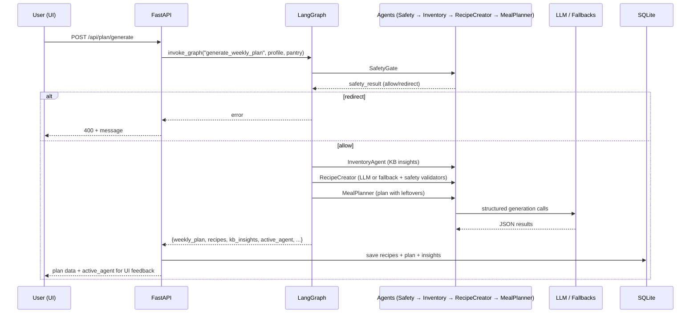

# System Architecture

NutriPlan AI is a full-stack agentic application consisting of a Python backend (FastAPI + LangGraph) and a modern Next.js frontend. The core intelligence is provided by a multi-agent system orchestrated with LangGraph.

## High-Level Architecture

```mermaid
graph TB
    subgraph "Frontend (Next.js)"
        UI[Premium UI<br/>Dark Mode, Animations<br/>Rich Media]
        State[TanStack Query State]
    end

    subgraph "Backend (Python)"
        API[FastAPI<br/>/api/* endpoints]
        Agents[LangGraph Agent Graph<br/>SafetyGate + 6 Specialized Agents]
        LLM[LLM Client<br/>Ollama / Grok / Fallbacks]
        KB[Packaged Foods KB<br/>Insights & Swaps]
        DB[(SQLite<br/>Local Persistence)]
    end

    UI -->|REST + SSE| API
    API -->|invoke_graph(intent, profile, pantry)| Agents
    Agents -->|LLM calls + structured output| LLM
    Agents --> KB
    Agents --> DB
    API --> DB
    UI <--> State
```

## Data Flow

1. **User Interaction**: User interacts with the beautiful Next.js UI (cards, chat, forms, dark mode toggle).
2. **API Calls**: Frontend uses a typed client (`lib/api.ts`) to call FastAPI endpoints under `/api`.
3. **Agent Orchestration**:
   - Every meaningful action calls `invoke_graph(intent, ...)` in the API layer.
   - The LangGraph StateGraph routes through:
     - `safety` (always first)
     - Conditional routing based on intent (profile, inventory, recipes_flow, plan_flow, etc.)
   - Agents collaborate: InventoryAgent feeds KB insights → RecipeCreator → MealPlanner, etc.
4. **Persistence**: All state (profiles, pantry, recipes, plans, shopping lists, feedback) is stored in local SQLite via the Repository (JSON blobs for flexibility).
5. **Streaming**: Chat uses Server-Sent Events for real-time token streaming from the LLM or fast-mode templates.
6. **Fallbacks**: When no LLM is available (no Ollama, no API key), template-based fallbacks ensure the app remains fully functional.

## Key Components

### Backend (`src/nutriplan/`)

- **agents/**: The heart of the agentic system.
  - `graph.py`: Builds the StateGraph, defines routing logic (`_route_after_safety`, `after_inventory`, etc.), and exposes `invoke_graph`.
  - `nodes.py`: Implementation of each agent node (profile_manager_node, inventory_agent_node, recipe_creator_node, meal_planner_node, shopping_list_optimizer_node, feedback_agent_node, safety_gate_node).
  - `state.py`: `NutriPlanState` TypedDict (user_profile, pantry, recipes, weekly_plan, kb_insights, safety_result, active_agent, etc.).
- **api/**: Thin adapter layer exposing the agents via REST.
  - `main.py`: FastAPI app with lifespan (auto-seed), CORS, routers.
  - `routers/`: One router per domain (profile, pantry, recipes, planner, shopping, feedback, chat, system).
  - Each generate endpoint calls the graph, handles safety results, persists via repo, and returns `active_agent` for UI feedback.
- **db/repository.py**: SQLite-backed repository using JSON for all entities. Single-user design (latest profile, etc.).
- **llm/**: LiteLLM abstraction + streaming + fallbacks. Supports Ollama, Grok, OpenAI.
- **knowledge/packaged_foods.py**: The Indian packaged foods KB for matching and insights (gentle swaps, no shaming).
- **safety/**: Deterministic guardrails (allergen_filter, guardrails for medical queries, output_validator).
- **models/schemas.py**: All Pydantic models (UserProfile, Recipe, WeeklyMealPlan, ShoppingList, etc.) + enums.

### Frontend (`frontend/`)

- **app/**: Next.js App Router pages matching the original Streamlit pages + enhanced UX.
  - `layout.tsx` + `AppShell.tsx`: Persistent sidebar nav, header with LLM status + dark mode toggle.
  - `page.tsx` (Home): Dashboard with metrics (animated counters), today's plan preview, inspiration photo gallery.
  - Rich pages for Profile, Pantry (with KB badges), Recipes (photo thumbnails + expandable details), Planner (day cards + confirmation), Shopping, Chat (real SSE streaming + agent pills), Feedback, How-it-works (visual agent flow with video).
- **components/**: Reusable UI (AgentPill, MedicalBanner, Disclaimer, ThemeToggle).
- **lib/api.ts**: Typed client for all backend endpoints.
- **public/images/** & **public/videos/**: 10+ custom-generated food photos and 2 cinematic videos for rich visual experience.
- Theming: Full dark mode via `next-themes` + CSS custom properties (beautiful adaptation of greens, golds, cards, etc.).
- Animations: Heavy use of framer-motion for card hovers, staggers, page transitions, loading step reveals, count-up metrics, etc.

### Data & Persistence

- Local SQLite (`data/nutriplan.db`).
- Synthetic/demo data in `data/synthetic/` and `data/sample/` for instant usability.
- All entities stored as JSON for schema flexibility.

## Communication Patterns

- Frontend ↔ Backend: REST (JSON) for commands/queries + SSE for chat streaming.
- No direct frontend-to-LLM; everything funnels through the agent graph for safety and consistency.
- Agents use structured output (Pydantic) + post-processing validators.

## Technology Choices & Rationale

- **LangGraph**: Enables true multi-agent collaboration, conditional routing, state management, and checkpointers (memory for potential future multi-turn).
- **FastAPI**: Modern, async, auto OpenAPI (`/docs`), great for thin API layer over the Python core.
- **Next.js + Tailwind + framer-motion**: Delivers the "premium consumer-grade" feel the PRD asked for (beyond basic Streamlit).
- **SQLite (local file)**: Privacy-first, zero setup, perfect for single-user desktop/local app.
- **LiteLLM**: Vendor-agnostic LLM access with easy fallbacks.

## Scalability Notes (Future)

Current design is intentionally single-user/local. For multi-user/SaaS:
- Add user auth + per-user DB isolation or schema.
- Replace MemorySaver with persistent checkpointer (e.g., Postgres).
- Background task queue for long-running generations.
- CDN for static assets/images/videos.

The architecture cleanly separates the agentic core (reusable) from the delivery layer (API + UI).

## Visual Flow (Simplified Agent Pipeline)



This diagram shows the collaborative, tool-using, safety-first nature of the agents.

For more details, see the [How it works](/how-it-works) page in the app (which includes an interactive visual flow and the spices video).

## Deployment Considerations

- Local: `uvicorn` + `next dev` (as documented in README).
- Docker: Possible (separate containers for Python API and Node frontend, or single container with multi-process).
- The frontend proxies `/api` to backend in dev via next.config rewrites.

The design keeps the powerful agentic Python core isolated and testable while delivering a delightful modern UI.